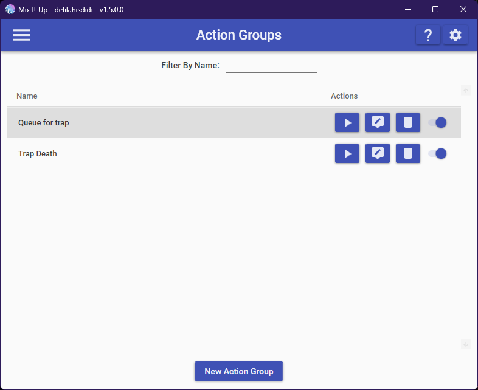
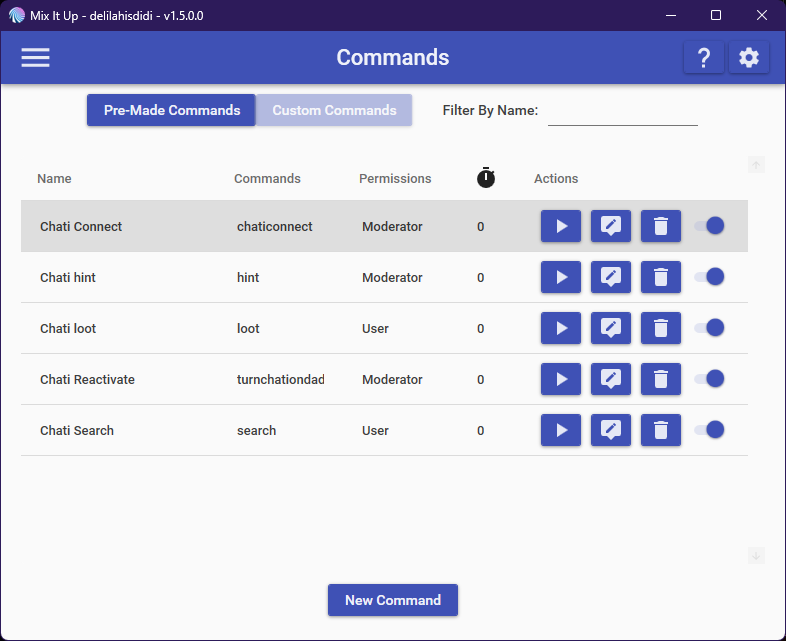
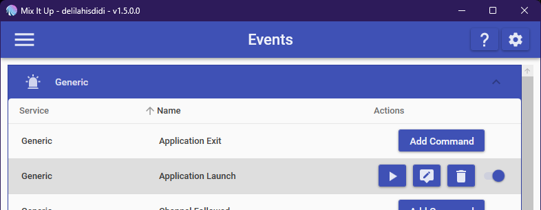
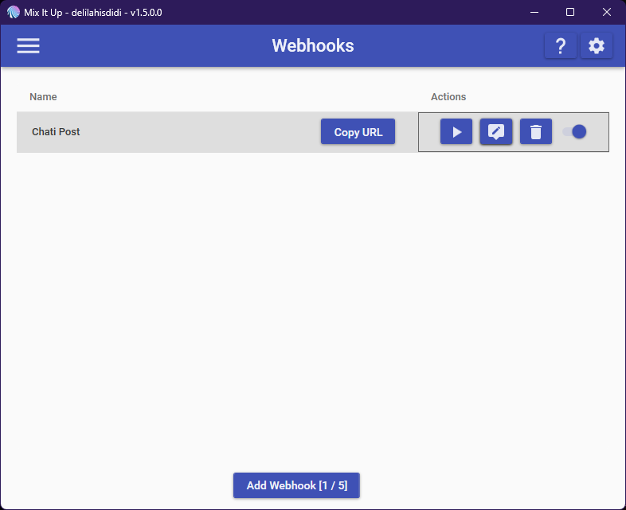

# MixItUp File Import Guide

> **Note:** MixItUp does not support importing all files at once. Each type must be imported separately.

## Contents
- Action Groups
- Commands
- Events
- Webhook

---

## Action Groups
These must be imported under **Action Groups**:

1. **Activate Queue for Traps** (`action_chatipelago_queutrap.miucommand`)
2. **Choose from Queue** (`action_chatipelago_trapdeath.miucommand`)

_MixItUp UI Example:_

---

## Commands
Import these under **Commands**:

1. `command_chati_hint` — `!hint`
   - Set permission: **Moderator** or higher (top left Usage Requirements)
2. `command_chati_connect` — `!chaticonnect`
   - Set permission: **Moderator** or higher
   - Set to **delete message after run** (bottom right Usage Requirements)
3. `command_chati_reactivate` — `!turnchationdaddy`
   - Set permission: **Moderator** or higher
   - Set to **delete message after run**
4. `command_chati_search` — `!search`
5. `command_chati_loot` — `!loot`

_MixItUp UI Example:_

---

## Events
Import under **Events > Generic > Application Launch**:

1. `events_chatipelago_applaunch`

_MixItUp UI Example:_

---

## Webhook
Import under **Webhook**:

1. `webhooks_chatipelago_chatipost`
   - After importing, click **Copy URL** and paste this into your Chatipelago Webhook URL setting.

_MixItUp UI Example:_

---

## How to Use
1. Download `mixitup_files.zip` and extract.
2. In MixItUp, navigate to the relevant section (Action Groups, Commands, Events, Webhooks).
3. Import the files as listed above. Reference the UI images above if unsure.
4. Set additional permissions or settings as described.

Questions? Bug Delilah https://github.com/lallaria/Chatipelago-Frontend